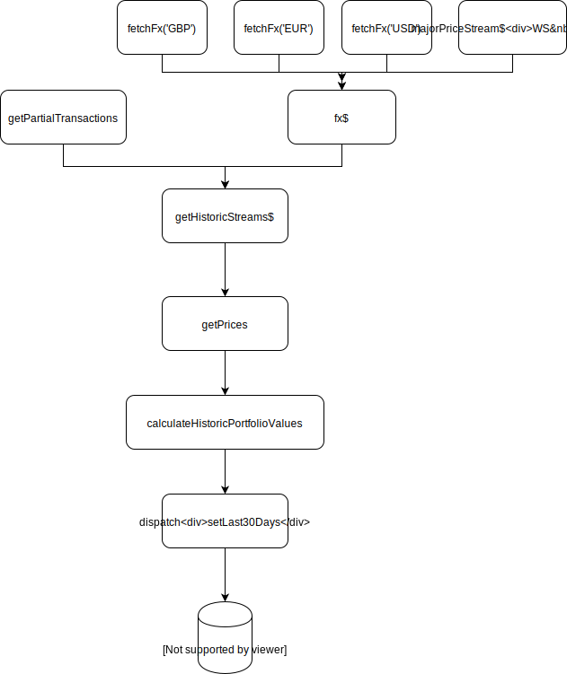

Last30DaysStream
===

A stream that at the end calculates the value of each asset at each day in a specific time range (by default 30 days).

The stream is a composition of several other streams which you see in the following diagramm.



Let's examine each stream in isolation.

**`getPartialTransactions`**
===

A stream that fetches all user's transactions from the Api by sending a fetch request.

**`fx$`**
===

A composition of multiple streams that all read some sort of crypto/fiat pricing information.

  i. `majorPriceStream$`: A WebSocket stream pushing prices for the major Cryptos i.e. BTC, ETH
  
  ii. `fetchFx('GBP')`: Gets prices for GBP through a fetch request.

  iii. `fetchFx('EUR')`: Gets prices for EUR through a fetch request.

  iv. `fetchFx('USD')`: Gets prices for USD through a fetch request.

**`getHistoricStream$`**
===

Returns an object of the following shape: 

```javascript
{
  txns: List<Transaction>, 
  distinctAssets: List<Asset>
  histoStreams$: List<Stream>
}
```

 - distinctAssets is the list of all assets in user's portfolio. e.g. BTC, ETH, XRP etc.
 - histoStreams$ is a list of streams that each fetches historic prices for all distinct aasets above. i.e. there will be one stream fetching prices for BTC the last 30 days. One more for ETH and for any other asset user currently possesses in his portfolio.

**`getPrices`**
===

Returns:

```javascript
{
  txns: List<Transaction>,
  prices: Map<Asset, List<Price>>
}

type Asset = 'GBP' | 'EUR' | 'USD'
type Price = {
  price: Number,
  market: string,
  ...
}
```

**`calculateHistoricPortfolioValues`**
===

Part of the common package that is responsible for calculating the value of each asset on each of the last n days (30 days by default).

I takes the outpout of `getPrices` above and returns a Map of the following shape:

```javascript
Map<Asset, AssetDayInfo>

type AssetDayInfo = {
  day: Timestamp,
  value: {
    capitalGain: Number,
    totalValue: Number
  }
}
```

Let's introduce some of the new terminology.

- **capitalGain**: A value that is calculated with the help of the reusable function `calculateCapitalGainForTheGivenPrice`. The logic of this function is as follows:

1. Find `HoldingOfTheday` which is the portfolio holdings on the given day. e.g.

```javascript
{
  ETH: 15,
  GBP: -5000,
  BTC: 3
}
```

Holding is essentially a map that for each asset will try to find the sum of all buy and sell positions. For example if I bought 2 BTC one day and then I sold 1 BTC,then the total holdings of BTC is 1. 

HoldingOfTheday is essentially the same logic except that we don't take the sum of the entire portfolio positions. We calculate the holdings of the assets that existed in the portfolio on the given date.

2. Keep just the fiat currency holdings i.e. GBP, EUR, USD.

3. Calculate the value for each holding with the help of the `calculateHoldingsValue`.

`calculateHoldingsValue` is a very important function and as you will see it will be used in the calculation of other metrics as well. At it's core, it does some simple tasks, it finds the `assetValue` of each asset. This is done redusing over the following function

```
amount * fx.getIn([asset, 'price'], 0)
```

for example 1(BTC) * £4000 = £4000

Bare in mind that `fx` contains the price of an asset in the currently selected currency. By default it is GBP, but user's can select amongst GPB, EUR, USD.

- **totalValue**

It will call `getTotalValueForTheGivenPrice` which is similar to the previous functions:

  i. `calculateHoldings(txns)`

  ii. `const portfolioValue = calculateHoldingsValue`

  iii. `return portfolioValue.assetValues.get(asset, 0)`
