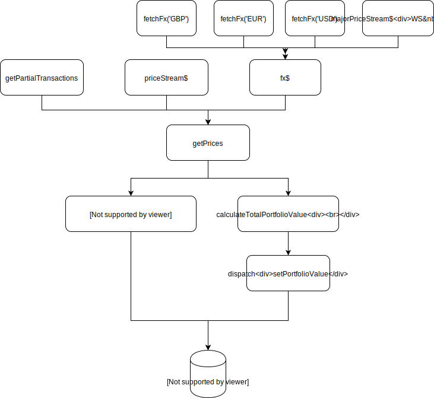

PortfolioValueStream
===

It consists of two parallel streams. There is the `streamInitialPrice` which preloads the store with prices and the `streamPrices` that updates prices in real-time.

You can see the flow of the `streamPrices` stream below.



Let's examine each part.

**`getPartialTransactions`**
===

A stream that fetches all user's transactions from the Api by sending a fetch request.

**`fx$`**
===

A composition of multiple streams that all read some sort of crypto/fiat pricing information.

  i. `majorPriceStream$`: A WebSocket stream pushing prices for the major Cryptos i.e. BTC, ETH
  
  ii. `fetchFx('GBP')`: Gets prices for GBP through a fetch request.

  iii. `fetchFx('EUR')`: Gets prices for EUR through a fetch request.

  iv. `fetchFx('USD')`: Gets prices for USD through a fetch request.

**`getPrices`**
===

Returns 

```javascript
{
  transactions: List<Transaction>,
  price: PriceData,
  fx: Map<Asset, PriceData>
}

type PriceData = {
  price: Number,
  market: string,
  ...
}
```

1. `Transactions`: The list of all user's transactions.
2. `price`: The price object we get from he WebSocket. It is a single price for one crypto. The order in which WS pushes these prices is not fixed as they come in real time. We randomly receive prices for all cryptos that we're listening to.
3. `fx`: We get this map from the redux store. We build this map incrementally and populate as we receive new prices fron the stream.

for example, if the WS pushes the price for `BTC`, then in the next iteration the prices map will contain a single entry with the price for BTC we received earlier. i.e. { BTC: 4000 }

4. `calculateTotalPortfolioValue`: Similar to `calculateHistoricPortfolioValues` we say earlier. It returns 

```javascript
{
  holdings: Map<Asset, Number>,
  capitalGain: Number,
  exposure: Number,
  value: Number
}
```

Let's see how each of those values is calculated.

i. `holdings`: We've seen this before. The holdings module will group all user's holdings into a map of the the following shape:

```javascript
Map<Asset, Number>
```

For example

```javascript
{
  ADA: 3520,
  ARK: 471,
  EUR: 6000
}
```

The value of each crypto indicates the quantity of the corresponding asset. There is conversion to the currently selected fiat currency at this point. So, in the example above, we have 3520 ADA tokens and not £3520 worth of ADA tokens.

ii. `exposure`: it is the result of the `calculatePortfolioExposure` function which takes two parameters. 

  - `exposureHoldings`: It has the following shapre

  ```javascript
   Map<FiatAsset, Number>

   type FiatAsset = 'GBP' | 'EUR' | 'USD'
  ```

  For example:

  ```javascript
  {
    EUR: 1522,
    GBP: 3600,
    USD: 1239
  }
  ```

Essentially, this is an object that holds the sum of the sell positions of all fiat currencies. In the example above, we have 1522 EUR exposure, which means we have purchased some assets by selling 1522 EUR in total. Similarly for the rest fiat currencies. Values are in the correspongind fiat currency. There is no conversion at this point.

  - `fx`: Same object we described before. It is incrementally updated while we get new prices from the WS. In the beginning we it won't include the prices of all cryptos. That's fine though, because, there is abaked in logic that will default the any calculation to 0 if there is a missing price.

The logic of `calculatePortfolioExposure` is similar to what we've done before. As we mentioned earlier, there is one very important utility function that participates in the calculation of several metrics. This function is `calculateHoldingsValue` which calculates the value of each asset as well as the total value of all assets. A value of an asset is a simple as the following formulat:

`quantity * price`

iii. `capitalGain`: We've seen this metric before. Here we consider the total holdings of all fiat currencies. Unlike in exposure, we consider both sell and buy positions. 

For example:

```
{
  EUR: 1000,
  GBP: -900,
  USD: -1239
}
```

Essentially, this is an object that holds the sum of the sell positions and buys of all fiat currencies. In the example above, we have -900 GBP capital gain, which means that it total we have -900 balance of GBP. That is we might have bough back some GBP (or not) but we definetely have sold more that we bought. Similarly for the rest fiat currencies. Values are in the correspongind fiat currency. There is no conversion at this point.

In plain english, capitalGain indicates the current value of fiat currencies. If it is positive, it means we have a positibe cash balance (gain) so far. If it's negative we have a negative cash balance (loss) so far. It is important to understand that this is not the total portfolio value. It is the value of fiat currencies ot the total cast available in the portfolio. In the above example we have -£900 but at the same time we might have £20K worth of bitcoins. This is important metric which will be used in the future to calculate things like taxation etc.

iv. `value`: Similar logic to the previous values except this time we call `calculateHoldingsValue` passing the total holdings, including both fiat and crypto assets.

To recap, `exposure`, `capitalGain` and `value` are calculated using the `calculateHoldingsValue` function but they differ in the holding object we pass a parameter. Following is the holdings we pass for calculating each of these metrics.

- `exposure`: Sum of all sell fiat positions 
- `capitalGain`: Sum of all buy fiat positions - Sum of all sell fiat positions.
- `value`: Sum of all asset buys - Sum of all asset sell position
